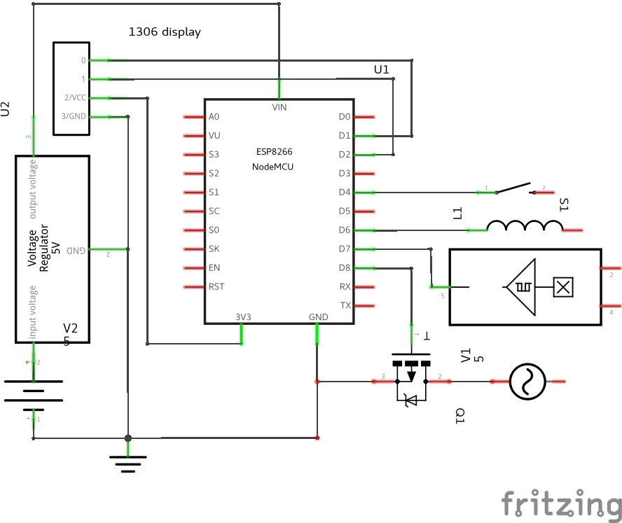

# Mopo

This is a micropython model of moped driving computer.  It is based on ESP8266
chip, NodeMCU to start with.

## Connected components are:

* Hall sensor for speed
* Spark plug capacitive wire with some filter logic
* Ignition signal wire for limiting ignition
* ssd1306 I2C display
* a button.

In our area mopeds are limited to speed of ~50 km/h. It's unlawful to drive
faster. Where as in reality people remove the limiters. Once buying such
used moped, there is the question how to limit it back. This device will
do limiting of ignition either based on speed or RPM. One can tune max values
for both.

This is work in progress, and doesn't really work ATM. It used to work before
I refactored into class model, but now there is some error.

## Electronics

Spark filter is built by using [this circuitry](http://www.sportdevices.com/rpm_readings/index.htm).

## Additional features TBD:

* Use button to change display
* Use button to activate WLAN AP
* Use button to deactivate limit for testing
* Web page to edit default limit values

## Libraries used

* [writer_minimal](https://github.com/peterhinch/micropython-font-to-py/blob/master/writer/writer_minimal.py)
  writes to display
* [ssd1306](https://github.com/micropython/micropython/blob/master/drivers/display/ssd1306.py)
  drives the display

Author: Ilkka Tengvall
License: GPLv3
